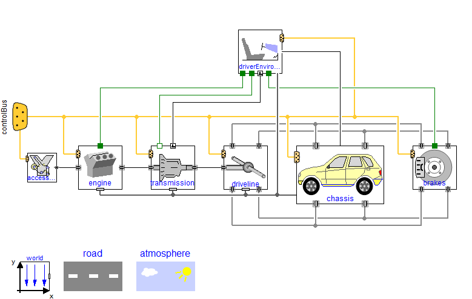

# VehicleInterfaces Library

Free library from the Modelica Association for interface definitions and architectures for vehicle system modeling

## Build status

## Library description

This Modelica library provides standard interface definitions for automotive subsystems and vehicle models. These are designed to promote compatibility between the various automotive libraries and provide a flexible, powerful structure for vehicle modelling. The main focus of the library is on defining the interfaces for the individual subsystems and a number of vehicle model examples are included to demonstrate how they might be used.

For an automotive library to be compatible with other libraries based on this set of interface definitions they should extend the interface definition from within this library and following the naming convention for the signal bus.

This library also contains a proposal for a naming convention covering the whole model library and the developers of this library would recommend that this convention is followed by other developers to ensure a consistent naming convention across the whole set of automotive models.

## Current release

Download [VehicleInterfaces v2.0.1 (2022-03-15)](../../releases/tag/v2.0.1)

## Older releases

Browse the [Releases](../../releases) page in order to get access to older releases of the library.

## License
Copyright &copy; 2005-2013, Dassault Systémes, DLR and Modelon 
Copyright &copy; 2013-2022, Modelica Association

This Modelica package is free software and the use is completely at your own risk;
it can be redistributed and/or modified under the terms of the [Modelica License 1.1](https://modelica.org/licenses/ModelicaLicense1.1).

## Development and contribution
The development is organised by individual members of the [Modelica Association](https://www.modelica.org/association).

You may report any issues with using the [Issues](https://github.com/modelica/VehicleInterfaces/issues) button.

Contributions in shape of [Pull Requests](https://github.com/modelica/VehicleInterfaces/pulls) are always welcome.
